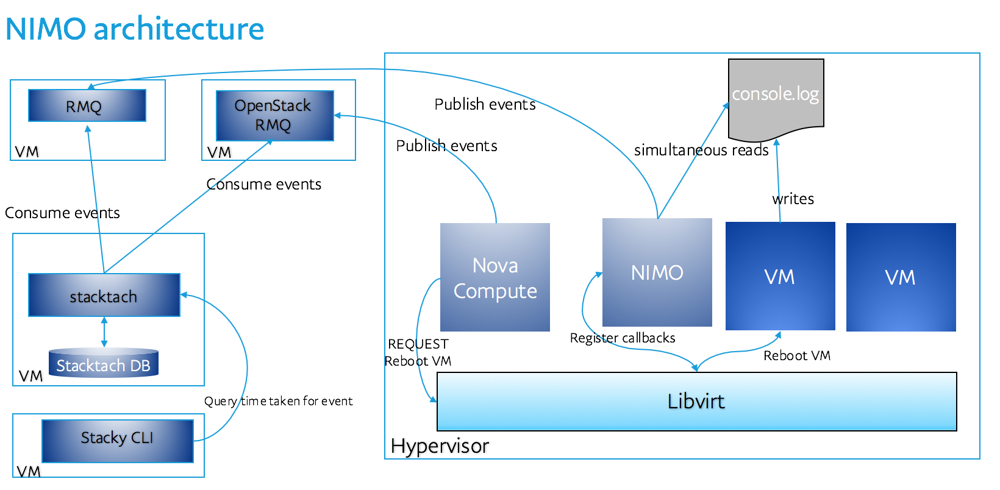

# NIMO
NIMO is Nova(Openstack project dealing with VM computes) Instance Monitoring tool.

NIMO tracks life cycle events for every VM running on a hypervisor.
On create, reboot events on a VM, NIMO will reconnaissance boot stages of that
VM. These boot stages are sent to configured RMQ service as event messages.

NIMO uses libvirt-python module to connect with libvirt on hypervisor, and
get callbacks for VM instance life cycle events.
NIMO makes use of reconn module to perform reconnaissance on console.log
file of the VM.

## Architecture
The below architecture shows how NIMO interacts with hypervisor and sends out
boot stages as RMQ messages. It also shows how existing project "Stacktack"
can be used to consume messages and report all activities of in nice Web-UI or
CLI "stacky"



## Download, Setup and Installing NIMO
```
$ virtualenv -v -p python2.7 virtual_env
$ source virtual_env/bin/activate
$ cd nimo
$ pip -v install .
```

## Running NIMO
```
$ nimo --config-file=./etc/nimo/nimo.conf --log-file=/var/log/nimo/nimo.log
```


## Developing and testing NIMO
##### Unit test execution:
Unit tests are located under: nimo/nimo/tests/unit/
```
$ cd nimo
$ tox -epy27
```
